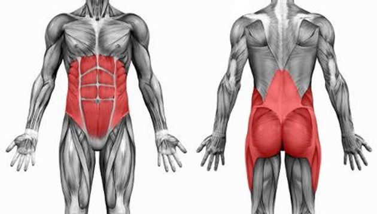
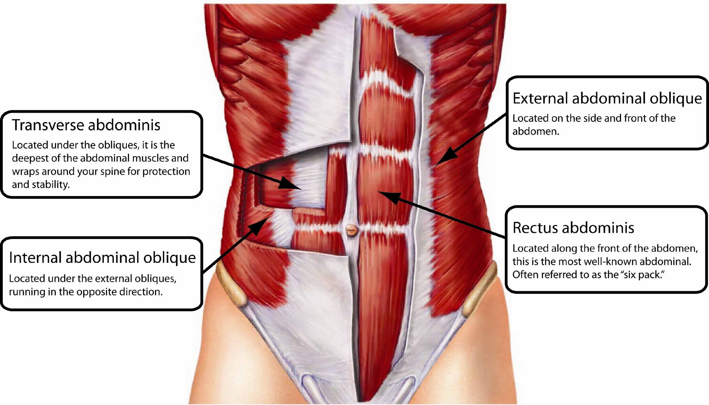
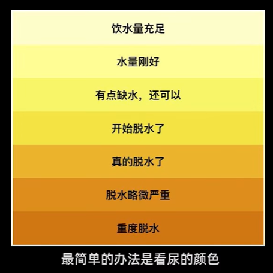

[toc]

# 知识点汇总

## 1 有关训练

### 1.1 激活弹跳

[参考视频: PAP 激活后增强 瞬间增加弹跳力](https://www.douyin.com/user/MS4wLjABAAAAuaeTxp0tLeLjcJ1y7D92e0cNUYjxiASnJtxKfZS7RSs?modal_id=7018154479316978977&showTab=post)

Post-Activation Potentiation (PAP): refers to a short-term improvement in performance (e.g. jumping) as a result of using a conditioning exercise (e.g. back squats). Many conditioning exercises, for example back squats, [deadlifts](https://www.scienceforsport.com/the-deadlift-form-benefits-and-workouts/), [plyometrics](https://www.scienceforsport.com/plyometrics/) and isometric contractions have all been shown to improve subsequent performances. This performance improvement is due to the muscles being placed into a 'potentiated', or 'activated' state.

**Conclusion**

1. 高箱弹震式深蹲: 4*3
2. 反向耸肩: 4*3
3. 训练后休息5分钟开始运动

### 1.2 核心

**摔跤运动员**

|      Plan01       | 组数 * 次数 | Plan02 | 组数 * 次数 |
| :---------------: | :---------: | :----: | ----------- |
|      实力翻       |    4 * 4    |        |             |
|     泽齐深蹲      |    4 * 6    |        |             |
|    牛脊式深蹲     |    3 * 4    |        |             |
| 悬垂提膝 / 脚踢杠 |   3 * 10    |        |             |

**橄榄球运动员**

**篮球运动员**

**举重运动员**

**短跑运动员**

### 1.3 山羊挺身

**benifit:** 对单脚起跳和跑步速度有提升

**step**

1. 以髋为轴, 腰保持中立
2. 腘绳肌有拉伸感和发力感

## 2 有关饮食

### 2.1 吃鸡蛋

[参考文献: The Effect of Whole Egg Intake on Muscle Mass: Are the Yolk and Its Nutrients Important?](https://pubmed.ncbi.nlm.nih.gov/34504041/)

> 1. yolk (n.) 蛋黄
> 2. comprise (v.) 包括

## 3 有关活动度

### 3.1 屈膝活动度

[参考视频: 脚跟碰不到屁股, 都要练这个动作](https://www.bilibili.com/video/BV1Rg4y1c7J8/?spm_id_from=333.999.0.0&vd_source=12bffefa5d42bc58bf47c962294d9bed)

反向北欧挺

## 4 有关休息

### 4.1 组间歇

[参考文献: Rest interval between sets in strength training.](https://pubmed.ncbi.nlm.nih.gov/19691365/)

[参考视频: 组间休息 你歇对了吗?](https://www.douyin.com/user/MS4wLjABAAAAuaeTxp0tLeLjcJ1y7D92e0cNUYjxiASnJtxKfZS7RSs?modal_id=7083842897996729604)

> 1. hypertrophy (n.) 肥大
> 2. modality (n.) 形式
> 3. velocity (n.) 速度
> 4. acute (adj.) 剧烈的
> 5. chronic (adj.) 慢性的
> 6. resistance exercise programmes 阻力训练计划
> 7. conversely (adv.) 反过来说
> 8. hormone (n.) 激素

**Conclusion**

1. In terms of **acute responses**, a key finding was that when training with loads between 50% and 90% of one repetition maximum, **3-5 minutes**' rest between sets allowed for greater repetitions over multiple sets. 
2. In terms of **chronic adaptations**, resting **3-5 minutes** between sets produced greater increases in absolute strength, due to higher intensities and volumes of training. 
3. When the training goal is **muscular hypertrophy**, the combination of moderate-intensity sets with short rest intervals of **30-60 seconds** might be most effective due to greater acute levels of growth hormone during such workouts.

### 4.2 恢复训练

**Conclusion**

1. 合理安排运动周期
2. 有效规避疲劳，拉长组间休息
3. 动作以闭链为主，深蹲、卧推、硬拉、引体、双杠臂屈伸等

### 4.3 补水

[参考视频: 夏日运动疲软无力？水可能没喝够，补水指南来了](https://www.bilibili.com/video/BV1ye4y1f7C9/?spm_id_from=333.999.0.0&vd_source=12bffefa5d42bc58bf47c962294d9bed)

- 判断身体是否脱水

  1. 看尿液的颜色
  2. 测量流汗的量

- 防止脱水

  > 体重减少2%(1.5L)或者更多会引发急性脱水

## 5 有关学术知识

### 5.1 Action Potential 动作电位

- WIKIPEDIA
  [Action Potential](https://en.wikipedia.org/wiki/Action_potential)
  [动作电位](https://zh.wikipedia.org/wiki/%E5%8A%A8%E4%BD%9C%E7%94%B5%E4%BD%8D)

### 5.2 Strech-Shortening Cycle(SSC)

- WIKIPEDIA

### 5.3 Hypertrophy肌肥大训练

[参考文献: Resistance Training Variables for Optimization of Muscle Hypertrophy: An Umbrella Review](https://www.frontiersin.org/articles/10.3389/fspor.2022.949021/full)

[参考视频: 怎么都练不大？增肌没效果？这个视频对你一定有帮助 22年肌肥大研究伞式分析讨论](https://www.bilibili.com/video/BV1jP4y1Z7jY/?spm_id_from=333.999.0.0&vd_source=12bffefa5d42bc58bf47c962294d9bed)

> 1. eccentric contraction 离心收缩
> 2. criteria n. (评判或做决定的)标准 
>    inclusion criteria 纳入标准
> 3. meta-analyse 荟萃分析
> 4. magnitude n. 巨大
>    magnitude of sth. XXX的量级
> 5. frontiers n. 尖端科学

**Conclusion**

1. At least **10 sets per week per muscle group** is optimal
2. **Eccentric contractions** seem important, very slow repetitions (≥10 s) should be avoided
3. **Blood flow restriction** might be beneficial for some individuals
4. Other variables as, exercise order, time of the day and type of periodization appear **not** to directly influence the magnitude of muscle mass gains.
